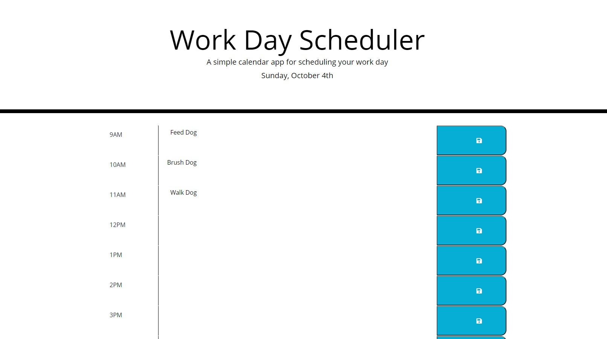

**Challenge 5:  Work Day Scheduler**

**What**
* In the Work Day Scheduler Challenge we were given the task of creating a daily 8 hour task schedule using a variety of concepts. This project was to include the following:
    * A daily date 
    * Time blocks for 9:00am to 5:00pm day
    * A text field in which tasks could be entered
    * A save button that would save the task into local storage
    * Color coding that would show past, current and future times

    **Why**
    * This scheduler was a good way for us to practice our knowledge of several concepts as well as giving us a finished product to use in our daily lives. 

**How**
* This challenge required the use of the following:
    * HTML
    * CSS
    * JavaScript
    * Bootstrap
    * JQuery
    * Moment.js
    * Font Awesome

**Link to github repository**:  https://github.com/sas1300/challenge5.git

**Link to URL:**  https://sas1300.github.io/challenge5/

**Screenshot of Project**
 